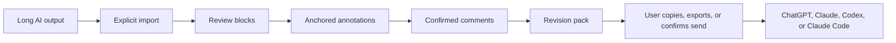
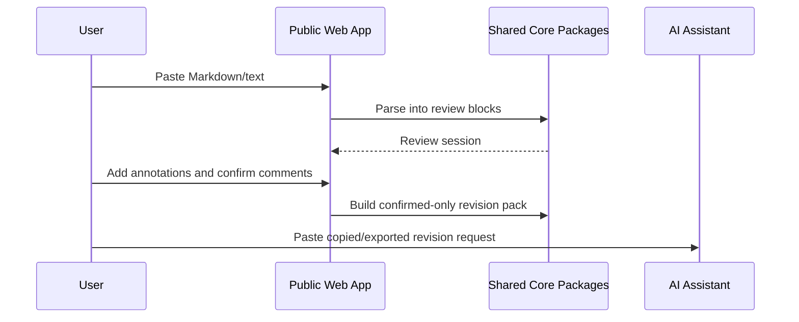
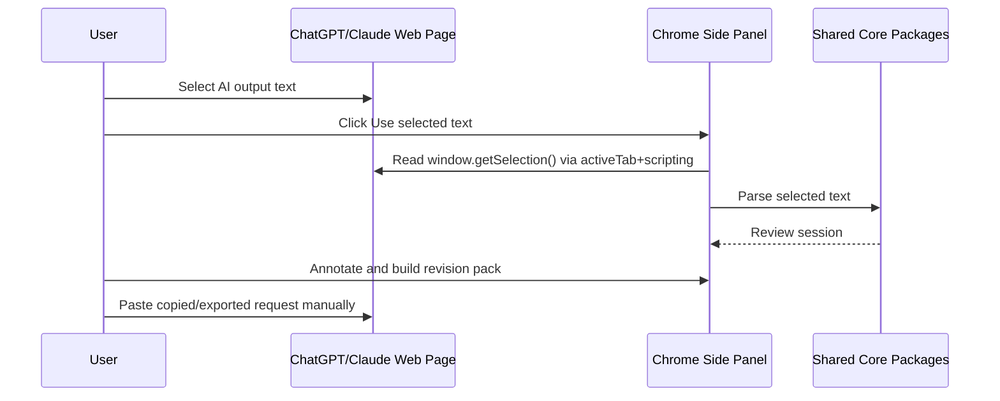
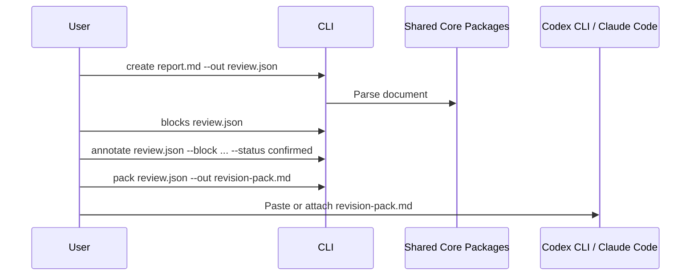
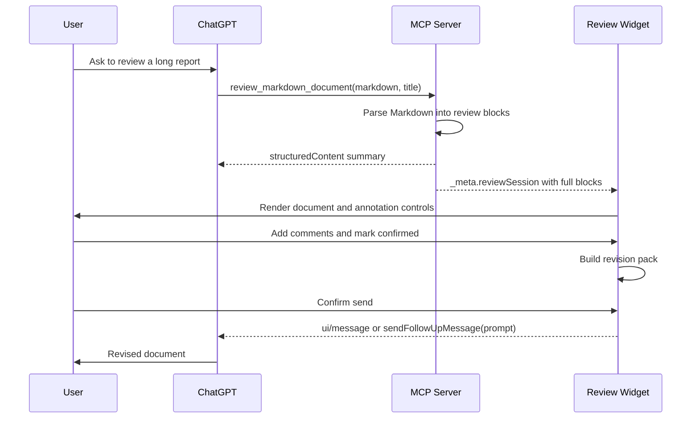

# Architecture

## Package Boundaries

```text
apps/chatgpt-app/server
  Node MCP server, Apps SDK tool/resource registration, /app web route, health/privacy routes

apps/chatgpt-app/web
  React review UI used by the public web app, browser extension side panel, and Apps SDK widget

apps/chatgpt-app/cloudflare-worker
  Production Worker adapter for /app, /mcp, /health, and /privacy

apps/browser-extension
  Chrome Manifest V3 side panel extension for ChatGPT web and Claude web

apps/cli
  Terminal adapter for file/stdin review sessions and revision-pack generation

packages/annotation-model
  Zod schemas, constants, IDs, shared types

packages/markdown-block-parser
  Markdown/GFM AST parsing into stable review blocks

packages/review-core
  Review session reducer, annotation operations, export/import

packages/revision-prompt-builder
  Confirmed annotations to revision prompt/revision pack
```

Core packages do not import ChatGPT, Codex, Claude, browser extension, VS Code, Cursor, or Cloudflare APIs.

## Current Release Flow



## Public Web Flow



## Browser Side Panel Flow



The extension does not request `<all_urls>` and does not read `document.body.innerText`.

## CLI Flow



## ChatGPT Apps SDK Technical Preview



This path is not claimed as an approved public ChatGPT App Directory app.

## Data Boundary

- `structuredContent`: model-visible Apps SDK summary only.
- `_meta.reviewSession`: Apps SDK widget-only hydrated session with blocks and full document-derived text.
- Public web app state: in-memory browser state until export/copy.
- Browser extension import: user-selected active-tab text only.
- CLI state: local JSON and Markdown files chosen by the user.
- Follow-up message: generated only after explicit user confirmation.
- Default revision message: confirmed annotations only, no full document resend.
- Revision pack export: local Markdown file fallback for web, extension, CLI, and bridge-unavailable environments.

## MCP Tool

`review_markdown_document`

- Purpose: render an explicitly supplied Markdown/text document for review.
- Input: `markdown`, optional `title`, optional `sourceLabel`.
- Limits: 100,000 Unicode chars or 300 review blocks.
- Annotation: `readOnlyHint: true`, `destructiveHint: false`, `openWorldHint: false`.

## Publication Wiring

- `/app`: public web app route on the Worker/server.
- `/mcp`: MCP endpoint for Apps SDK Developer Mode and future official submission.
- `APP_PUBLIC_BASE_URL`: public deployment origin used for health/reporting.
- `APP_WIDGET_DOMAIN`: production widget domain surfaced as `_meta.ui.domain`.
- `APP_PRIVACY_POLICY_URL`: reviewed privacy policy URL surfaced in `/health`.
- `APP_CSP_CONNECT_DOMAINS`: comma-separated exact domains for widget network calls.
- `APP_CSP_RESOURCE_DOMAINS`: comma-separated exact domains for widget resources.
- `APP_CSP_FRAME_DOMAINS`: optional exact frame domains; avoid unless the UI truly embeds subframes.

## Platform Boundaries

- ChatGPT web and Claude web: supported through public web/manual paste and Chrome side panel selected-text import.
- Codex CLI and Claude Code: supported through CLI files and generated revision packs.
- Claude Desktop: future MCPB/desktop-extension packaging only; no native Claude Desktop message UI modification is claimed.
- ChatGPT Apps SDK: technical preview until publisher verification and OpenAI approval are complete.
