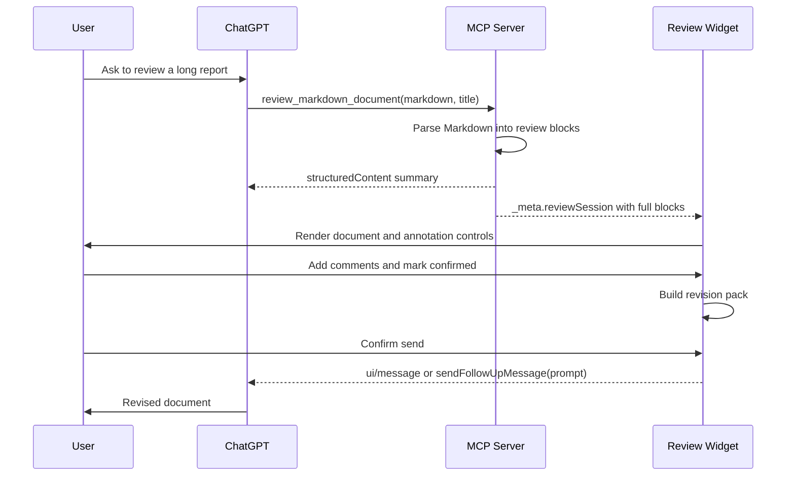

# Architecture

## Package Boundaries

```text
apps/chatgpt-app/server
  Node MCP server, Apps SDK tool/resource registration, health/privacy routes

apps/chatgpt-app/web
  React desktop widget, MCP Apps bridge, local annotation UI

packages/annotation-model
  Zod schemas, constants, IDs, shared types

packages/markdown-block-parser
  Markdown/GFM AST parsing into stable review blocks

packages/review-core
  Review session reducer, annotation operations, export/import

packages/revision-prompt-builder
  Confirmed annotations to revision prompt/revision pack
```

Core packages do not import ChatGPT, Codex, Claude, browser extension, VS Code, or Cursor APIs.

## ChatGPT Apps SDK Flow



## Data Boundary

- `structuredContent`: model-visible summary only.
- `_meta.reviewSession`: widget-only hydrated session with blocks and full document-derived text.
- Widget state: local annotations, selected block, status filter.
- Follow-up message: generated only after explicit user confirmation.
- Default revision message: confirmed annotations only, no full document resend.
- Revision pack export: local Markdown file fallback for debugging or bridge-unavailable environments.

## MCP Tool

`review_markdown_document`

- Purpose: render an explicitly supplied Markdown/text document for review.
- Input: `markdown`, optional `title`, optional `sourceLabel`.
- Limits: 100,000 Unicode chars or 300 review blocks.
- Annotation: `readOnlyHint: true`, `destructiveHint: false`, `openWorldHint: false`.

## Publication Wiring

- `APP_PUBLIC_BASE_URL`: public deployment origin used for health/reporting.
- `APP_WIDGET_DOMAIN`: production widget domain surfaced as `_meta.ui.domain`.
- `APP_PRIVACY_POLICY_URL`: reviewed privacy policy URL surfaced in `/health`.
- `APP_CSP_CONNECT_DOMAINS`: comma-separated exact domains for widget network calls.
- `APP_CSP_RESOURCE_DOMAINS`: comma-separated exact domains for widget resources.
- `APP_CSP_FRAME_DOMAINS`: optional exact frame domains; avoid unless the UI truly embeds subframes.

## Desktop Scope

The widget is desktop-first. Narrow viewport CSS exists to avoid incoherent overflow during local smoke checks, but mobile UX is not a v1 product promise. Mobile smoke is still a pre-submission gate because OpenAI review can exercise mobile clients.
